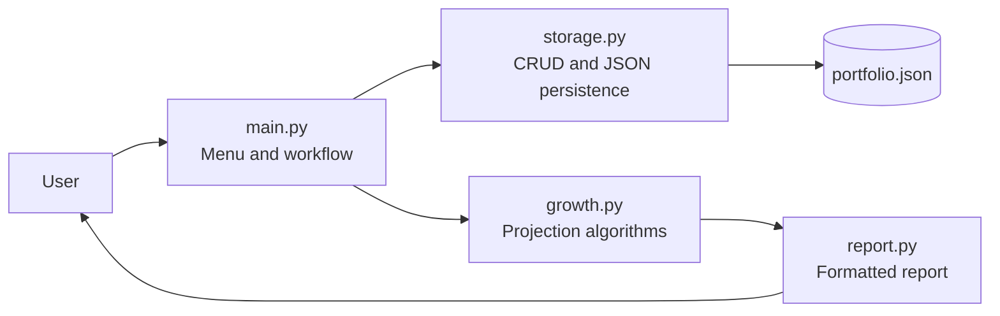
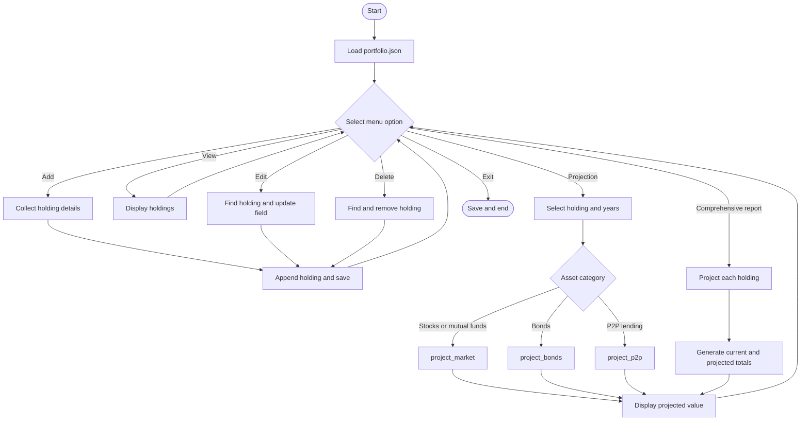
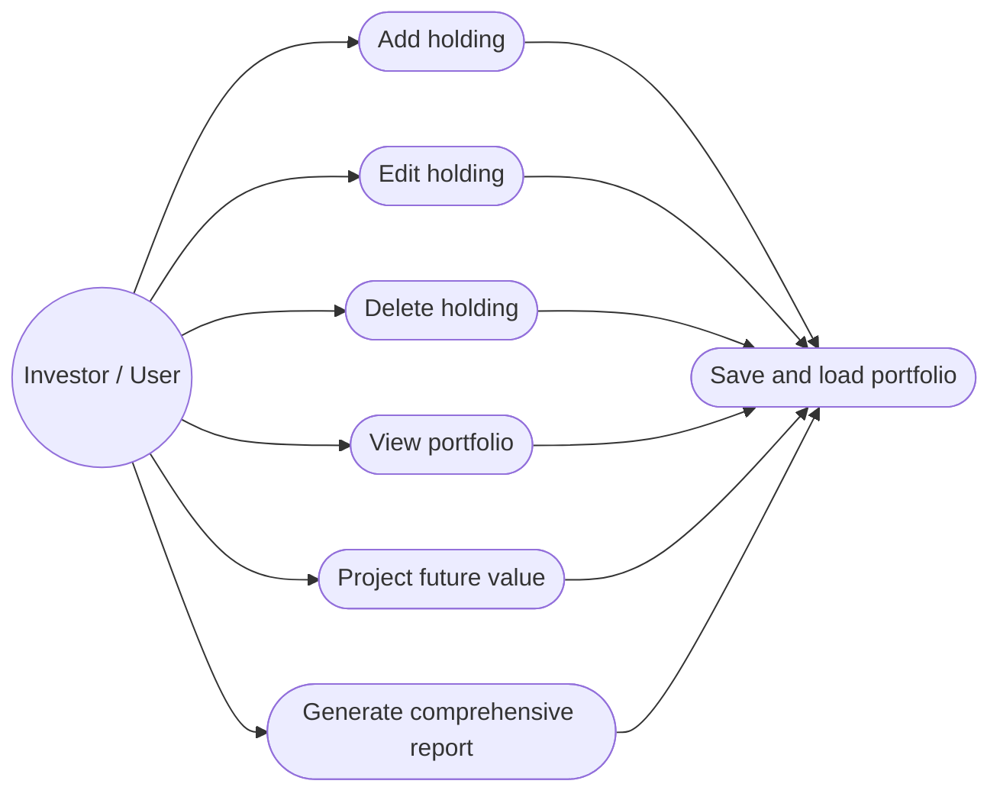
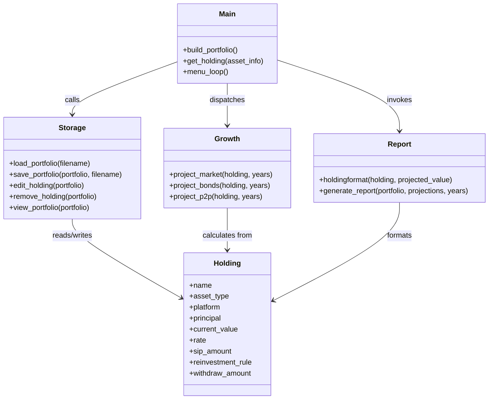
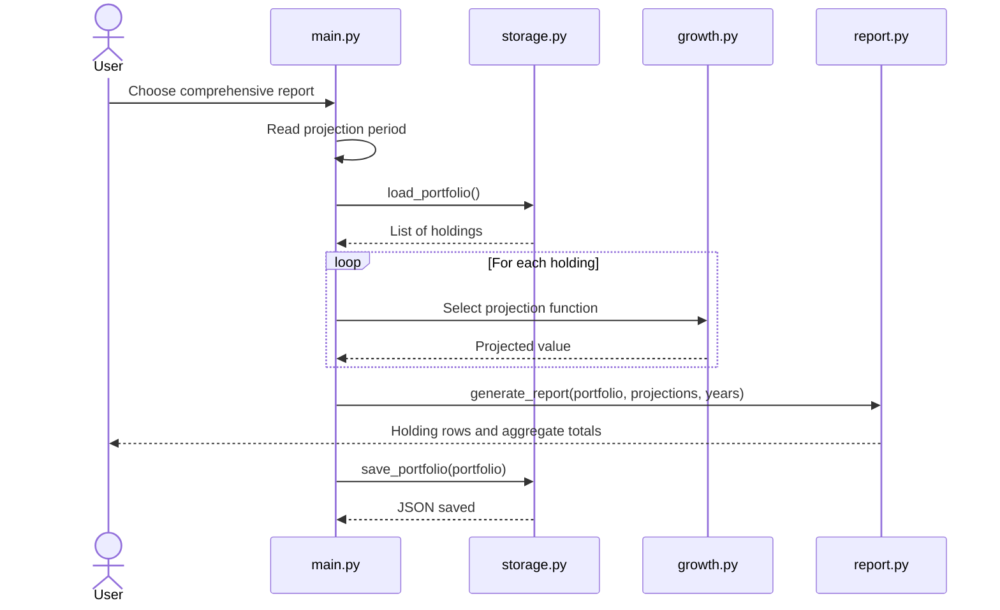
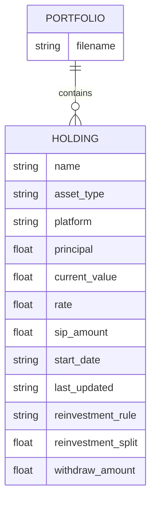

# Portfolio Projection and Management System

## Project Report

**Course:** CSE CORE 
**Project:** Financial portfolio projection
**Prepared by:** Jishnu Dhinakar  
**Register number:** 26BCE10758   


## 1. Introduction

Anyone who invests in more than one place ends up with scattered records: stocks in a broker app, SIPs on another platform, bonds somewhere else, a P2P lending account, maybe a spreadsheet. Simple questions then take real effort. What is everything worth today? What might it be worth in five years? What happens to the estimate if I stop reinvesting bond coupons?

This project is a local Python program that keeps all of it in one place. You enter holdings through a numbered menu, and they are saved to a JSON file. Each holding is projected forward using rules for its asset type, and one report shows current and projected value for every holding and for the total.

## 2. Problem Statement

Investors need a low-cost way to keep records of mixed holdings and get a rough forward estimate from the same data. The tool should accept structured holding details, keep them between runs, let the user correct or delete entries, and show current and projected values in one report.

## 3. Objectives

- Build a command-line portfolio manager that runs with only the Python standard library.
- Split the code into separate modules for input, storage, calculation and reporting.
- Store holdings in JSON and support add, view, edit and delete.
- Use different projection rules for market assets, bonds and P2P lending.
- Produce one readable consolidated report.

## 4. Functional Requirements

| ID | Requirement | Input | Output |
| --- | --- | --- | --- |
| FR-01 | Add holdings | Asset type, name, platform, financial values, dates, and rule | New holding saved in `portfolio.json` |
| FR-02 | View portfolio | Existing JSON data | Formatted list of all holdings |
| FR-03 | Edit holding | Holding name, field, replacement value | Updated holding |
| FR-04 | Delete holding | Holding name | Matching holding removed |
| FR-05 | Project market assets | Holding and number of years | Estimated future value |
| FR-06 | Project bonds | Bond holding and number of years | Estimated value after coupon handling |
| FR-07 | Project P2P lending | P2P holding and number of years | Estimated future value |
| FR-08 | Generate report | Portfolio and projection period | Current total, projected total, and holding-level output |
| FR-09 | Persist data | In-memory portfolio | JSON file written to disk |

## 5. Non-Functional Requirements

| Category | Requirement |
| --- | --- |
| Usability | The numbered menu and prompts should make the main workflow understandable to a beginner. |
| Maintainability | Responsibilities are divided between `main.py`, `storage.py`, `growth.py`, and `report.py`. |
| Reliability | Portfolio data is restored from a local file and saved after major operations. Missing files result in an empty portfolio. |
| Performance | Projection algorithms run in linear time with respect to the number of years for one holding, and the application is suitable for small personal portfolios. |
| Portability | The application uses Python and standard-library JSON, so it can run on common operating systems without third-party packages. |
| Error handling | The storage layer handles a missing portfolio file; future versions should extend validation for malformed JSON and invalid user input. |
| Security | Data remains local and is not transmitted to external services; the current version does not provide encryption or authentication. |
| Scalability | The modular projection and storage functions provide a base for adding database storage, more asset models, or a graphical interface. |

## 6. System Architecture

The application uses a simple layered structure:

- **Presentation/orchestration layer:** `main.py` manages the menu, prompts, and workflow.
- **Persistence and portfolio operations layer:** `storage.py` loads/saves JSON and performs CRUD/display functions.
- **Domain calculation layer:** `growth.py` contains asset-specific projection algorithms.
- **Reporting layer:** `report.py` formats holding-level and aggregate results.
- **Data layer:** `portfolio.json` stores an array of holding objects.



## 7. Process Flow / Workflow Diagram



## 8. UML Diagrams

### 8.1 Use Case Diagram



### 8.2 Component / Class Diagram



### 8.3 Sequence Diagram: Comprehensive Report



## 9. Database / Storage Design

The application uses a JSON document rather than a relational database. The root value is an array of holding objects.

### 9.1 Schema

| Field | Type | Description |
| --- | --- | --- |
| `name` | string | Unique user-facing holding name used for lookup |
| `asset_type` | string | Stocks, MutualFunds, Bonds, P2P_Lending, or custom type |
| `platform` | string | Broker, platform, or provider |
| `principal` | number | Original invested amount |
| `current_value` | number | Current value used as the projection starting point |
| `rate` | number | Annual rate as a decimal |
| `sip_amount` | number | Monthly contribution |
| `start_date` | string | Start date in `YYYY-MM-DD` format |
| `last_updated` | string | Last user-provided update date |
| `reinvestment_rule` | string | `none`, `full`, `partial`, or `fixed_amount_withdraw` |
| `reinvestment_split` | number | Percentage used by the partial rule |
| `withdraw_amount` | number | Monthly fixed withdrawal |



## 10. Design Decisions

**JSON, not a database.** This is a single-user tool holding a few dozen records at most. JSON needs no setup, I can open it in a text editor to check what the program wrote, and it made testing easier. The cost is that nothing stops a hand-edit from corrupting the file, and it would not cope with concurrent use or large data.

**One projection function per asset type.** Market assets, bonds and P2P loans handle cash flows differently. One function each keeps every rule short enough to check by hand, and adding a new asset type does not touch the others.

**Projecting from current value.** Every projection starts from `current_value`, not `principal`, because current value is the latest state of the holding. Principal is kept for display only.

**A menu-driven CLI.** It kept the project on the course material (functions, loops, file I/O, modules) and avoided framework dependencies.

## 11. Implementation

`storage.py` loads and saves the JSON file and holds the add, edit, delete and view functions, all working on a list of dictionaries. `main.py` collects input and routes each menu choice. `growth.py` holds the three projection functions:

- **Market assets:** each year adds the annual gain, then twelve months of SIP contributions, then applies any withdrawal rule.
- **Bonds:** each year computes a coupon from current value, then pays it out, reinvests it fully, reinvests part of it, or adjusts for a fixed withdrawal, depending on the rule chosen.
- **P2P lending:** each year applies the rate, then adjusts for partial or fixed withdrawals.

Projected values below zero are set to zero. `report.py` prints each holding and the totals, and `main.py` picks the right projection function for each holding before calling it.

## 12. Results

[Replace this section with real output from your own run: the main menu, the portfolio view, one single-holding projection, and the full report. Fix the missing space before "Projected:" in the report output first.]

**Worked example** (this is what a reviewer will check first):

| Input | Value |
| --- | --- |
| Holding / type | [e.g. one of your sample holdings] |
| Current value | [₹] |
| Annual rate | [%] |
| Monthly SIP | [₹] |
| Years | [n] |
| Program output | [₹] |
| Hand calculation | [₹] |

[One sentence: do the two numbers match? If not, why?]

## 13. Testing

I tested by hand, comparing the console output with `portfolio.json` after each step. Syntax was checked with:

```bash
python -m py_compile main.py storage.py growth.py report.py
```

| Test | Expected | Result |
| --- | --- | --- |
| Load existing JSON | List of holdings returned | [pass/fail] |
| Load missing JSON | Empty list returned | [pass/fail] |
| Add holding | Appended and saved | [pass/fail] |
| View empty portfolio | "No holdings" message | [pass/fail] |
| Edit existing field | Field changes | [pass/fail] |
| Edit unknown holding | Not-found message | [pass/fail] |
| Delete existing holding | Removed | [pass/fail] |
| Project positive rate | Future value for requested years | [pass/fail] |
| Apply withdrawal rule | Value reflects withdrawal | [pass/fail] |
| Generate report | All projections and totals printed | [pass/fail] |

There are no automated tests. Edge cases I did not test: zero years, zero current value, negative rates, and withdrawals larger than the annual gain. [say whether that's true]

## 14. Challenges and Limitations

[Pick the two or three that actually cost you time, and say what went wrong and how you fixed it. From your draft: keeping JSON field names consistent across input, storage, calculation and reporting; fitting different reinvestment rules into one holding structure; annual rates against monthly SIPs and withdrawals.]

Known limitations: [confirm each against your code]

- Projections use a fixed rate, with no inflation, tax or fees.
- SIP contributions earn no return in the year they are added.
- Invalid input and malformed JSON are not fully handled.
- Data is stored unencrypted.

## 15. Learnings

[Three or four things you would only know from building this. Replace "modular files help" with a specific example, e.g. a bug that a module boundary made easy to find, or a place where mixing input and calculation code hurt you.]

## 16. Future Work

1. Automated tests, starting with the edge cases in Section 13.
2. Input validation for numbers, dates, rates, duplicate names and malformed JSON.
3. Optimistic, expected and conservative scenarios side by side.
4. Inflation, tax and fees in the projections.
5. Charts and CSV export.

## 17. References

1. Python Software Foundation. *Python Documentation: `json` — JSON encoder and decoder*. https://docs.python.org/3/library/json.html
2. Python Software Foundation. *Python Documentation: Built-in Types and Control Flow*. https://docs.python.org/3/tutorial/
3. Mermaid. *Mermaid Diagramming and Charting Tool*. https://mermaid.js.org/
4. Course handout: *VITyarthi - Build Your Own Project: General Project Instructions & Submission Guidelines*.